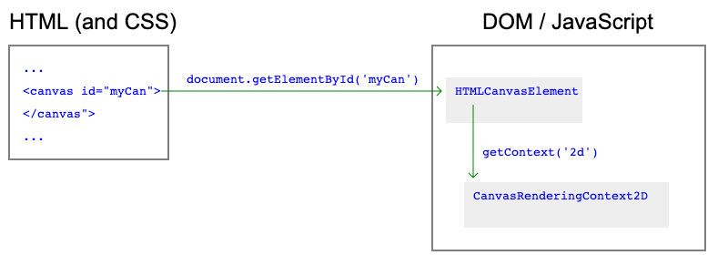

# The Canvas API
The Canvas API is a powerful HTML5 element that enables you to draw graphics and render visual content directly on a web page. By using the Canvas API, you can create dynamic visualizations, games, animations, charts, graphs, and more. It provides a programmable drawing surface using JavaScript, allowing you to manipulate pixels and create custom graphics.

The **`<canvas>`** element provides a blank canvas on which you can draw various shapes, paths, images, and text using JavaScript commands. The Canvas API offers a comprehensive set of methods and properties for drawing and manipulating graphical elements.

 

### Canvas API example to draw a basic shape:

```html
<!DOCTYPE html>
<html lang="en">
<head>
    <meta charset="UTF-8">
    <meta name="viewport" content="width=device-width, initial-scale=1.0">
    <title>Canvas API Example</title>
</head>
<body>
    <canvas id="myCanvas" width="400" height="300"></canvas>

    <script>
        const canvas = document.getElementById('myCanvas');
        const context = canvas.getContext('2d');

        // Draw a blue rectangle
        context.fillStyle = 'blue';
        context.fillRect(50, 50, 200, 150);

        // Draw a red circle
        context.beginPath();
        context.arc(250, 150, 50, 0, Math.PI * 2, false);
        context.fillStyle = 'red';
        context.fill();
        context.closePath();
    </script>
</body>
</html>
```

In this example:
- The `<canvas>` element is used to create a drawing surface with a width of 400 pixels and a height of 300 pixels.
- The `getContext('2d')` method returns a 2D drawing context that you can use to draw on the canvas.
- The `fillRect` method is used to draw a blue rectangle with a top-left corner at (50, 50) and dimensions of 200x150 pixels.
- The `arc` method is used to draw a red circle with a center at (250, 150), a radius of 50 pixels, and spanning a full circle.